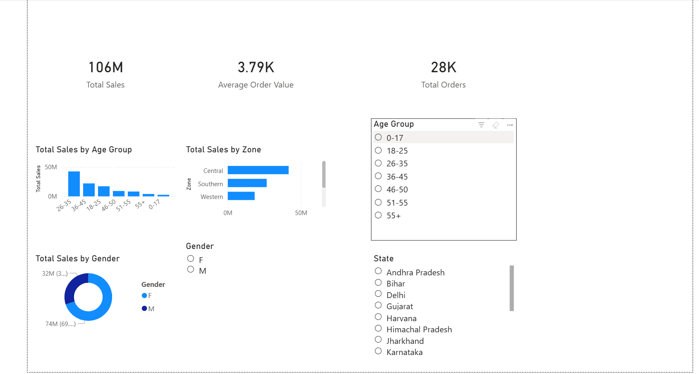
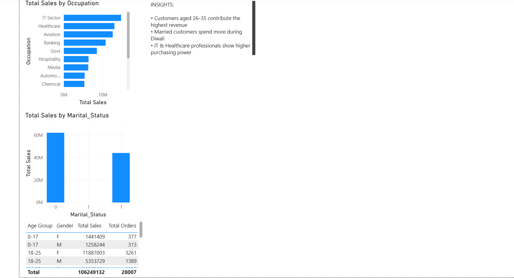
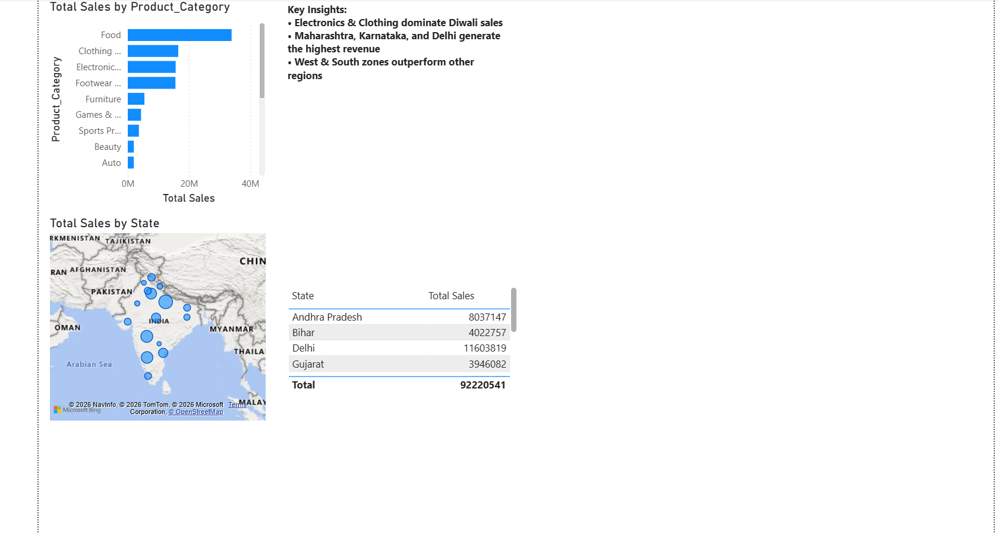
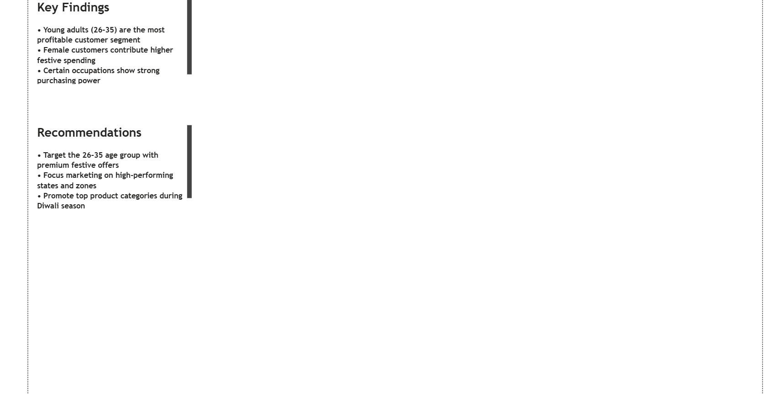

# 📊 Business Performance Dashboard

## 📌 Project Overview
An interactive Power BI dashboard built to monitor business revenue, track KPIs, and analyze performance metrics across business units. Designed for non-technical stakeholders using visual storytelling principles.

## 🛠️ Tech Stack
- Power BI, DAX

## ⚙️ Features
- Revenue and sales trend monitoring across time periods
- KPI cards for at-a-glance business health tracking
- DAX calculations for dynamic metric computation
- Period-over-period comparisons
- Slicers and filters for drill-down analysis by segment

## 📸 Dashboard Preview
*## 📸 Dashboard Preview

### Overview

### Customer Insights

### Product & Region

### Insights & Recommendations
*

## 📁 Files
| File | Description |
|------|-------------|
| `business_dashboard.pbix` | Power BI dashboard file |
| `dashboard_preview.png` | Screenshot of the dashboard |

## 💡 Key Learnings
- Data modeling and relationship building in Power BI
- Writing DAX measures for calculated KPIs
- Designing dashboards for non-technical audiences
